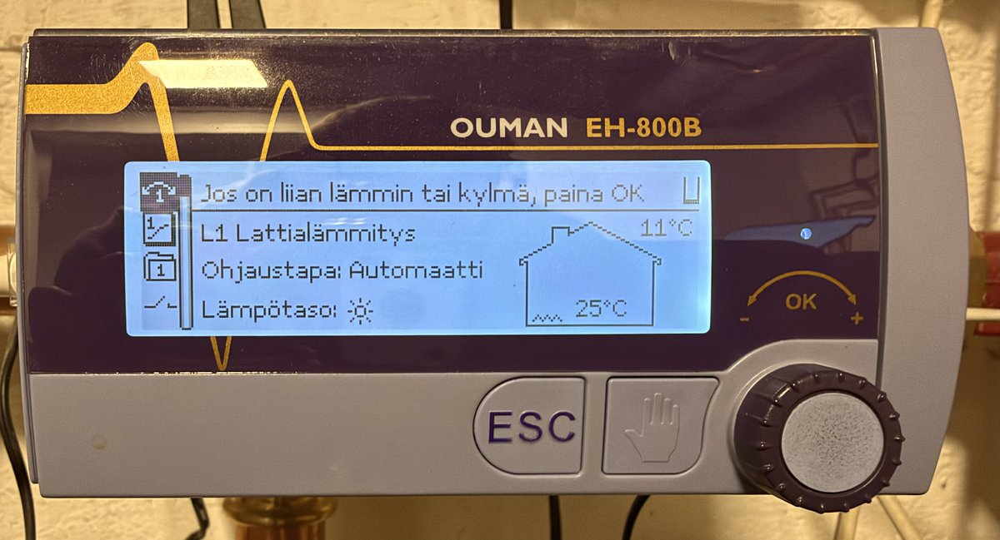
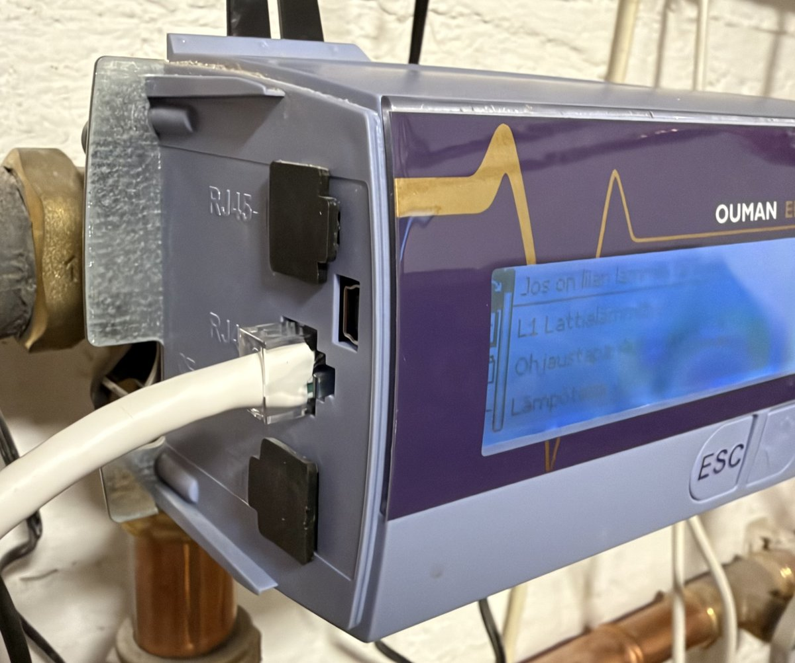
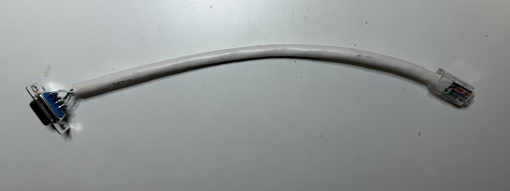

# ouman-serial

`ouman-serial` gives programs access to an **Ouman EH-800B** heating controller through its GSM
modem port. It is a plumbing tool: it sends the controller's SMS commands and returns the
replies in a structured form. What you do with the values is up to you.



## How it works

The EH-800B has no network interface. It can use an optional GSM modem on its RJ45-2 port, and
then you can read and change its settings with SMS messages.

`ouman-serial` connects to RJ45-2 with an RS-232 cable and **emulates the modem**. The
controller initializes the emulated modem and polls it for received SMS messages. When you
send a command, the server gives it to the controller as a received SMS, and catches the SMS
reply that the controller sends back.

The tool has two parts in one binary:

- `ouman-serial serve`: the server. It owns the serial port, emulates the modem, and serves an
  HTTP API. Run it as a service.
- `ouman-serial send | get | set | select | status`: the command-line client. It calls the
  server's HTTP API.

## Tradeoffs

- **Each message beeps.** The controller beeps each time that it receives an SMS. The manual
  has no setting to stop this.
- **The daily SMS limit.** The controller sends at most 5 to 100 SMS messages per day
  (*Tekstiviestien vrk-rajoitus*). Each reply counts, and a long reply counts as several
  messages. The counter resets once a day. When the limit is used up, the controller still
  receives and applies your commands, but it does not reply. So:
  - **Reads need budget.** A `get` without a reply fails.
  - **Writes always apply**, but without budget they are not confirmed.
  - The tool is not good for frequent status polling. Use it for commands, and get
    measurements from other sensors if you need them often.
- **"Received" and "confirmed".** "Received" means that the controller took the message from
  the emulated SIM. "Confirmed" means that a reply came, and that it shows the requested value.
  For writes, "received" counts as success, because writes apply also without a reply.
- **The server is the modem.** When the server stops, the controller has no modem. It seems
  to look for a modem every 37 seconds, and it initializes the modem again automatically when
  the server starts again.

## Hardware

### Cable

The RJ45-2 port is under a lid on the left side of the Ouman EH-800B. The power cord and temperature
sensor jack are on the opposite side.



RJ45-2 is an **RS-232 port, not Ethernet**. To connect to an RS-232 serial port,
make a cable with an RJ45 plug on one end and a female DE-9 connector on
the other:

| RJ45 pin | Female DE-9 pin |
|---|---|
| 1 | 5 (GND) |
| 7 | 2 (adapter RxD) |
| 8 | 3 (adapter TxD) |



Pins 2 to 6 are not used for the modem connection, but they probably have another function.
Leave them unconnected.

### Serial port

The easiest is to use a USB-RS232 adapter. Some old PCs may have a built-in serial port.
For Raspberry Pi, use a serial hat, MAX3232 converter, or similar.

Serial port parameters: 9600 baud, 8N1, and no flow control.

## Controller configuration

On the controller, go to *Laiteasetukset → Tekstiviestiasetukset* (SMS settings):

| Setting | Value |
|---|---|
| Sanomakeskuksen numero (SMS centre) | Empty. The controller reads it from the emulated SIM. |
| PIN-koodi | Empty. |
| Laitetunnus (device ID) | Empty. If you set it, put the same value in `device_id` in the configuration. |
| Hälytysnumero 1 (alarm number) | Any phone number, for example `+358401234567`. |
| Tekstiviestien vrk-rajoitus (daily limit) | 100, and the same value in `daily_limit` in the configuration. |

Connect the cable, start the server, and power cycle the controller. The controller looks for
the modem when it starts. When it finds the modem, the display shows
**"Modeemi käyttökunnossa!"**.

## Installation

These instructions are for Raspberry Pi OS. The server runs on all Raspberry Pi models, also
the Pi 1B.

### Build

Build the binary on another computer, and copy it to the Pi. The build was tested on Linux. A build on the
Pi itself is very slow, especially on the older models.

Select the target from the output of `uname -m` on the Pi:

| `uname -m` on the Pi | Target |
|---|---|
| `armv6l` or `armv7l` (32-bit OS, all models) | `arm-unknown-linux-musleabihf` |
| `aarch64` (64-bit OS) | `aarch64-unknown-linux-musl` |

Install Rust with [rustup](https://rustup.rs), and build. For example, for a 32-bit OS:

```sh
rustup target add arm-unknown-linux-musleabihf
cargo build --release --target arm-unknown-linux-musleabihf
```

The binary is static. The repository configures the Rust linker for these targets, so no C
cross compiler is necessary.

Copy the binary and the installation files to the Pi. Use your own user name and host name:

```sh
scp target/arm-unknown-linux-musleabihf/release/ouman-serial \
    ouman-serial.example.toml ouman-serial.service pi@raspberrypi.local:
```

Do the remaining steps on the Pi, in the directory with the copied files. Install the binary:

```sh
sudo install -m 755 ouman-serial /usr/local/bin/ouman-serial
```

### Service

Make a system user that has access to the serial ports (the `dialout` group):

```sh
sudo useradd --system --no-create-home --shell /usr/sbin/nologin --groups dialout ouman-serial
```

Install the configuration. It can contain the API token, so only the service user can read it:

```sh
sudo install -m 640 -g ouman-serial ouman-serial.example.toml /etc/ouman-serial.toml
sudoedit /etc/ouman-serial.toml
```

Set `serial_port` to your device. `ls /dev/serial/by-id/` shows the USB adapters.

Install and start the systemd unit:

```sh
sudo install -m 644 ouman-serial.service /etc/systemd/system/
sudo systemctl daemon-reload
sudo systemctl enable --now ouman-serial
journalctl -u ouman-serial -f
```

To see all serial traffic, set `trace = true` in the configuration.

## Usage

### Command line

```sh
ouman-serial status                                   # the server and the controller link
ouman-serial send '?'                                 # the list of keywords
ouman-serial get Ouman                                # outdoor and supply temperatures
ouman-serial get "L1 menovesi-info"                   # how the supply setpoint is calculated
ouman-serial get "L1 asetusarvot"                     # the main setpoints
ouman-serial set "L1 asetusarvot" "Menoveden minimiraja=26.0"
ouman-serial select "L1 ohjaustavat" "Jatkuva normaalilämpö"
ouman-serial send Kotona                              # home: normal heat level
```

- `get KEYWORD` sends a keyword and shows the reply.
- `set KEYWORD LABEL=VALUE...` changes one or more fields. Write the labels as the
  controller writes them in its replies.
- `select KEYWORD OPTION` selects an option in a list, for example the control mode.
- `send TEXT` sends any text, for keywords that need no parameters or for experiments.

The keywords are in Finnish, `send '?'` lists them.

The output is the result and the reply text. Use `--json` for the full response. `--no-wait`
returns when the controller has received the message, without a wait for the reply.

| Exit code | Result |
|---|---|
| 0 | `confirmed`, or `received` for `send`, `set` and `select` |
| 1 | An error, or `received` for `get` (no reply) |
| 2 | `rejected`: the reply does not show the requested value |
| 3 | `not received`: the controller did not take the message in time |
| 4 | `not sent`: the controller does not poll for messages |

The client connects to `http://127.0.0.1:8765` by default. Use `--server URL` or
`OUMAN_SERIAL_URL` for another address, and `--token` or `OUMAN_SERIAL_TOKEN` for the token.

### HTTP API

All requests and responses are JSON. A request returns when its result is known, which can take
up to about 40 seconds, plus the time in the queue.

| Endpoint | Request body |
|---|---|
| `POST /v1/send` | `{"text": "Kotona", "no_wait": false}` |
| `POST /v1/get` | `{"keyword": "L1 menovesi-info"}` |
| `POST /v1/set` | `{"keyword": "L1 asetusarvot", "fields": {"Menoveden minimiraja": "26.0"}, "no_wait": false}` |
| `POST /v1/select` | `{"keyword": "L1 ohjaustavat", "option": "Automaatti", "no_wait": false}` |
| `GET /v1/status` | |

```sh
curl -s localhost:8765/v1/set -H 'Content-Type: application/json' \
  -d '{"keyword": "L1 asetusarvot", "fields": {"Menoveden minimiraja": 26}}'
```

```json
{
  "result": "confirmed",
  "warnings": [],
  "reply": {
    "raw": "L1 ASETUSARVOT: Menoveden minimiraja=26.0",
    "title": "L1 ASETUSARVOT",
    "segments": [
      {"type": "field", "label": "Menoveden minimiraja", "value": "26.0"}
    ]
  }
}
```

`result` is one of `confirmed`, `received`, `rejected`, `not_received` and `not_polling`. A
segment of the reply is a `field` (label and value), an `option` (text, and whether it is
selected), or `text`.

Errors have a JSON body `{"error": "..."}`, with HTTP status 400 for an invalid request, 401
without a valid token, and 503 when the queue is full.

### Alarms

When the controller has an alarm, it sends an SMS to its alarm numbers, and the server gets
it. The server logs each alarm. If `alarm_hook` is set, the server also runs it as a shell
command, with this JSON on stdin:

```json
{
  "destination": "+358401234567",
  "raw": "HÄLYTYS: Menoveden lämpötila=50.0/ MA 23.3.2009 13:31",
  "title": "HÄLYTYS",
  "segments": [{"type": "field", "label": "Menoveden lämpötila", "value": "50.0"}, {"type": "text", "text": "MA 23.3.2009 13:31"}],
  "time": "2026-09-27T14:03:10.123+03:00"
}
```

Alarms also count against the daily SMS limit.

## License

MIT. See [LICENSE](LICENSE).
